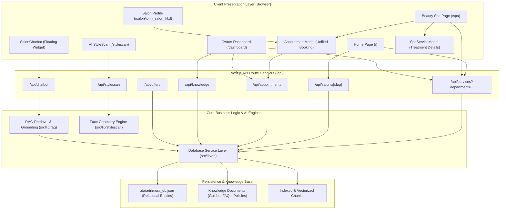

# Trimora: System Architecture & Technical Documentation
**Platform:** John Salon + Beauty Spa (`john_salon_kkd`)  
**Version:** 2.0.0 (Unified Salon Grooming & Beauty Spa Platform)  
**Location:** Bhanugudi Junction, Kakinada, Andhra Pradesh  

---

## 1. Executive Overview

**Trimora** is a full-stack, luxury digital platform engineered for premium salons, boutique barbershops, and luxury wellness sanctuaries. The platform unifies:
1. **Atelier Salon Grooming**: Precision haircuts, beard sculpting, keratin treatments, hair coloring.
2. **Beauty Spa Sanctuary**: Private-suite facial therapies, body relaxation massages, manicures/pedicures, and bridal rituals.
3. **AI RAG Concierge**: A zero-hallucination conversational assistant grounded in authentic salon data, service menus, prices, and protocols.
4. **StyleScan AI**: A privacy-first face geometry analysis and personalized hairstyle recommendation engine.
5. **Unified Priority Booking Engine**: 4-step appointment scheduling with instant reference codes, department tabs, and real-time validation.
6. **Owner Operations Dashboard**: Complete CRUD management for services, promotional offers, appointment dispatching, and RAG knowledge ingestion.

---

## 2. Technology Stack

### 2.1 Frontend Tier
| Technology | Version / Spec | Purpose & Justification |
| :--- | :--- | :--- |
| **Next.js** | `14.2.15` (App Router) | Server-Side Rendering (SSR), Static Site Generation (SSG), client-side transitions, and API Route Handlers under a unified monorepo. |
| **React** | `18.3.1` | Declarative component model, hooks (`useState`, `useEffect`, `useRef`), and reactive UI updates. |
| **TypeScript** | `5.5.4` | Strict static typing across domain models, API payloads, and component props for rock-solid runtime stability. |
| **Tailwind CSS** | `3.4.1` | Curated luxury design system: dark editorial palette (`#0A0A0A`, `#141414`), champagne golds (`#C5A880`, `#E5C590`), ivory typography, glassmorphism, and responsive breakpoints. |
| **Lucide React** | `0.453.0` | Lightweight, scalable vector iconography (scissors, sparkles, clock, calendar, flower, shield, etc.). |

### 2.2 Backend & API Tier
| Technology | Specification | Purpose & Justification |
| :--- | :--- | :--- |
| **Next.js Route Handlers** | Node.js Runtime (`/api/*`) | Primary web application RESTful micro-endpoints handling salon services, appointments, StyleScan, and RAG chatbot. |
| **Express Backend** | Express 5 (`server.js`, port 5000) | Standalone microservice backend supporting CORS, JSON payloads, and `/api/chat` RAG routing. |
| **Mongoose ODM** | Mongoose 9 (`db.js`) | MongoDB connection client with environment variable configuration (`process.env.MONGODB_URI`). |
| **HTTP Methods** | `GET`, `POST`, `PATCH`, `DELETE` | Standard REST conventions with JSON payloads and HTTP status codes (`200`, `201`, `400`, `404`, `500`). |

### 2.3 Data & Persistence Tier
| Technology | Specification | Purpose & Justification |
| :--- | :--- | :--- |
| **Relational Schema Engine** | In-Memory with File Sync (`src/lib/db/index.ts`) | Fast, zero-latency database layer with relational entities (`salons`, `services`, `offers`, `appointments`, `knowledge_documents`, `knowledge_chunks`, `reviews`). |
| **JSON Persistence** | `.data/trimora_db.json` | Local file-backed database supporting transactional persistence across dev server restarts and hot reloads. |
| **Production Ready** | 1-to-1 Supabase / PostgreSQL Mapping | Data structures, foreign keys (`salon_id`, `service_id`, `document_id`), and UUIDs are designed for direct drop-in migration to PostgreSQL / Supabase. |

### 2.4 AI & Machine Learning Subsystems
| Technology | Implementation | Function |
| :--- | :--- | :--- |
| **RAG Vector Search** | Cosine Similarity + TF-IDF Vectorizer | In-memory term weighting and vector dot product search over chunked salon knowledge guides and service menus. |
| **Anti-Hallucination Engine** | Strict Thresholding & Verification | Enforces ground truth rules: only returns verified menu prices and timings, with graceful fallback to salon concierge contacts. |
| **StyleScan Geometric Vision** | Proportion Analysis Algorithm (`FaceAnalysisEngine`) | Calculates vertical thirds, cheekbone-to-jawline ratios, classifies face shapes (Oval, Square, Round, Heart, Oblong, Diamond), and ranks hairstyles with geometric compatibility explanations. |

---

## 3. High-Level System Architecture



---

## 4. Subsystems Deep Dive

### 4.1 Salon Grooming & Beauty Spa Engine

The platform implements a **dual-department domain architecture**:
- **Department `salon`**:
  - Services: Precision Fade & Scissor Cut, Beard Sculpting, Keratin Smoothing Therapy, D-Tan Glow Facial, Italian Balayage, Scalp Detox, Express Beard Trim.
  - Context: Barber styling stations, modern scissor craftsmanship, tailored consultation notes.
- **Department `spa`**:
  - Services: 24K Gold Luxury Radiance Facial, Hydra-Derm Infusion, Organic Cleanup, Swedish Full Body Relaxation Massage, Deep Tissue Muscle Therapy, Luxury Champagne & Rose Pedicure, Collagen Gel Manicure, Full Body Botanical Polish, Rica Chocolate Waxing, Royal Pre-Bridal Glow Ritual.
  - Context: Private sanctuary cabins, heated beds, organic cold-pressed botanicals, post-ritual herbal teas.
- **Unified Treatment Schema**:
  ```typescript
  interface Service {
    id: string;
    salon_id: string;
    department?: 'salon' | 'spa';
    name: string;
    category: ServiceCategory;
    description: string;
    price: number;              // In Indian Rupees (INR ₹)
    duration_minutes: number;
    image_url?: string;
    benefits?: string[];         // Key treatment advantages
    preparation?: string;       // Pre-appointment guidance
    aftercare?: string;         // Post-appointment guidance
    is_active: boolean;
  }
  ```

### 4.2 AI RAG Conversational Concierge

The **RAG (Retrieval-Augmented Generation)** subsystem prevents hallucinations by strictly decoupling answering from outside training data:

#### Key Architecture Components:
1. **Groq LLM Engine (`groq-sdk`)**:
   - Model: `process.env.GROQ_MODEL || "openai/gpt-oss-20b"`
   - Temperature: `0` (Deterministic, zero-creativity factual extraction)
   - Fallback: `"I don't have that information. Please contact John Salon at 6303522044."`
2. **Embedding Pipeline (`@huggingface/transformers`)**:
   - Model: `Xenova/all-MiniLM-L6-v2` (Feature-extraction, mean pooling, normalized)
   - Vectors: Pre-indexed in `rag/vectorstore/vectors.json` via `npm run rag:build`
3. **Strict 11 Rules Guardrail (`createRAGPrompt`)**:
   - 1. Answer ONLY using the information provided in the CONTEXT.
   - 2. Do not use outside knowledge.
   - 3. Do not invent information.
   - 4. Do not guess prices.
   - 5. Do not guess service durations.
   - 6. Do not guess appointment availability.
   - 7. Do not guess discounts.
   - 8. Do not guess cancellation policies.
   - 9. Do not guess refund policies.
   - 10. Do not guess payment information.
   - 11. Do not claim an appointment is available unless the booking system confirms it.
   - Live availability rule: *"For live appointment availability, say that availability must be confirmed directly with John Salon."*

```
[User Message] 
       │
       ▼
[Vector Retrieval Engine]
 ├─ Query Vector: Generated via Xenova/all-MiniLM-L6-v2
 └─ Cosine Similarity Search over rag/vectorstore/vectors.json (Top-3)
       │
       ▼
[Context Assembly & Prompt Synthesis]
 Injects Top-3 chunks into createRAGPrompt(context, question)
       │
       ▼
[LLM Execution & Strict Verification]
 ├─ If GROQ_API_KEY set: Groq openai/gpt-oss-20b (temperature: 0)
 └─ If not set / fallback: Grounded deterministic answer from internal database
       │
       ▼
[Response Output]
 ├─ Grounded Answer with verified rates & durations
 ├─ Source Citations (e.g. john_salon_beauty_spa_guide.txt)
 └─ Fallback: "I don't have that information. Please contact John Salon at 6303522044."
```

### 4.3 Trimora StyleScan Vision & Recommendation Engine

The **StyleScan** system delivers bespoke aesthetic consultation without compromising client biometric privacy:
1. **Client Consent Gate**: Explicit acknowledgment before camera or upload activation.
2. **Ephemeral Processing**: Client imagery is processed in memory; no biometric templates or face data are permanently stored or sold.
3. **Morphological Analysis**:
   - Computes facial width-to-length ratio.
   - Evaluates jawline taper, cheekbone prominence, and forehead curvature.
   - Classifies face structure: `Oval`, `Square`, `Round`, `Heart`, `Oblong`, or `Diamond`.
4. **Multi-Constraint Hairstyle Ranking**:
   - Cross-references face shape compatibility with user preferences (hair length, daily maintenance commitment, style vibe, and hair texture).
   - Generates top 3 tailored styles with match percentages, styling notes, and geometric harmony rationales.
5. **1-Click Booking Integration**: Clicking *"Book This Style"* launches `AppointmentModal` with the consultation summary automatically attached to the stylist notes.

### 4.4 Unified Appointment Booking System

The booking workflow manages reservations through a four-stage state machine backed by `booking.js` and `AppointmentModal.tsx`:

#### Booking Engine Architecture (`booking.js` & `src/lib/booking.ts`):
- **`BookingStatus`**:
  - `PENDING`: `"pending"` (Default state upon creation)
  - `CONFIRMED`: `"confirmed"`
  - `CANCELLED`: `"cancelled"`
  - `COMPLETED`: `"completed"`
- **`validateBooking(data)`**: Validates required fields (`customerName`, `phone`, `serviceId`, `date`, `time`). Returns `{ valid: boolean, errors: Record<string, string> }`.
- **`createBooking(data)`**: Creates an immutable reservation object with ID (`booking_${timestamp}`), reference code (`TRM-${last6}`), and ISO timestamp.

```
[Step 1: Service Selection]
  User filters by "All Services", "Salon Grooming", or "Beauty Spa".
       │
       ▼
[Step 2: Date & Window Selection]
  User selects from next 7-14 days and pre-calibrated time slots (09:30 AM to 06:45 PM).
       │
       ▼
[Step 3: Guest Information]
  validateBooking(data) validates customerName, phone, serviceId, date, time.
  Captures context-aware preferences (e.g. skin allergies / pressure for Spa; fade depth for Salon).
       │
       ▼
[Step 4: Dispatch & Confirmation]
  createBooking(data) generates unique reference code (e.g. TRM-588610).
  Saves appointment status as "pending".
  Notifies salon concierge for confirmation.
```

---

## 5. Directory & File Structure

```
trimora/
├── .data/
│   └── trimora_db.json              # Local JSON database (synced with db layer)
├── docs/
│   └── SYSTEM_ARCHITECTURE.md       # Complete system architecture documentation
├── src/
│   ├── app/                         # Next.js App Router
│   │   ├── layout.tsx               # Root layout (Dark theme, Navbar, Footer)
│   │   ├── page.tsx                 # Home page (Cinematic hero, services, StyleScan preview)
│   │   ├── globals.css              # Custom styling, gold shimmer animations, scrollbars
│   │   ├── spa/
│   │   │   └── page.tsx             # Dedicated Beauty Spa sanctuary landing page
│   │   ├── salon/
│   │   │   └── [slug]/page.tsx      # Salon profile, full catalog, reviews, offers
│   │   ├── stylescan/
│   │   │   └── page.tsx             # AI StyleScan face analysis & recommendation suite
│   │   ├── dashboard/
│   │   │   └── page.tsx             # Owner management dashboard & knowledge studio
│   │   └── api/                     # REST API Route Handlers
│   │       ├── salons/[slug]/route.ts
│   │       ├── services/route.ts
│   │       ├── appointments/route.ts
│   │       ├── chatbot/route.ts
│   │       ├── stylescan/route.ts
│   │       ├── knowledge/route.ts
│   │       └── offers/route.ts
│   ├── components/                  # Modular React Components
│   │   ├── common/
│   │   │   ├── Navbar.tsx           # Global navigation with Salon & Spa links
│   │   │   └── Footer.tsx           # Atelier brand footer & hours
│   │   ├── booking/
│   │   │   └── AppointmentModal.tsx # Multi-step booking modal with department tabs
│   │   ├── chatbot/
│   │   │   └── SalonChatbot.tsx     # Floating RAG AI conversational widget
│   │   ├── spa/
│   │   │   └── SpaServiceModal.tsx  # Luxury treatment modal with benefits & aftercare
│   │   └── dashboard/               # Owner admin widgets
│   └── lib/                         # Core Libraries & Domain Logic
│       ├── types/index.ts           # Complete TypeScript domain interfaces
│       ├── db/index.ts              # Database class, in-memory store & seed loader
│       ├── rag/index.ts             # TF-IDF chunking, cosine retrieval & RAG response
│       └── stylescan/index.ts       # Face analysis algorithms & hairstyle knowledge base
├── next.config.mjs                  # Next.js configuration & remote image patterns
├── tailwind.config.ts               # Custom luxury color tokens & font configurations
├── tsconfig.json                    # TypeScript compiler configuration
└── package.json                     # NPM dependencies & scripts
```

---

## 6. Security, Privacy & Performance

1. **Strict Client Privacy**:
   - StyleScan does not persist biometric face templates.
   - All uploaded images can be cleared immediately with client-side memory release.
2. **Anti-Hallucination Data Integrity**:
   - RAG responses are strictly verified against the internal database and ingested salon documents.
   - Prices and opening hours are never extrapolated or guessed.
3. **Performance Optimization**:
   - Zero external runtime database latency via synchronized in-memory caching.
   - Responsive lazy loading and next-gen responsive image styling.
   - Clean client hydration without heavy third-party tracking scripts.
